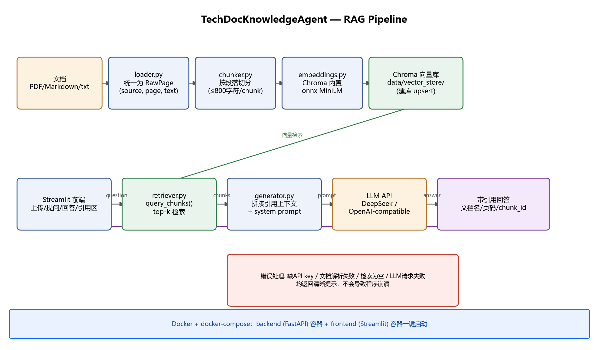

# TechDocKnowledgeAgent

> 面向技术文档的 RAG 智能知识库问答系统,支持 PDF/Markdown/txt 上传、语义检索、引用溯源和 Docker 一键部署。

## 项目背景

技术文档数量庞大,传统关键词搜索效率低。本项目基于 RAG,让用户通过自然语言提问,从文档中获得带引用来源的答案。

## 技术栈

- Backend: FastAPI
- Frontend: Streamlit
- RAG Pipeline: Custom pipeline in Phase 1; LangChain/LangGraph in later phases
- Vector DB: Chroma / Qdrant
- Embedding: Chroma 内置 onnxruntime MiniLM(Phase 1，免 API key/大模型下载）；后续可换 bge-m3 / API embedding
- LLM: DeepSeek API / Qwen API
- Retrieval: BM25 + vector search + rerank in Phase 2
- Deployment: Docker + docker-compose

## 架构图



## 功能截图

_(TODO: 补充至少 3 张截图到 docs/demo_screenshots/ —— 上传区、提问+回答、引用来源)_

## 本地运行

```bash
# 1. install dependencies
pip install -r backend/requirements.txt
cp .env.example .env

# 2. start backend
uvicorn backend.app.main:app --reload

# 3. start frontend
streamlit run frontend/streamlit_app.py
```

## 命令行工具（用于验证 RAG pipeline，无需前端）

```bash
# 1. 解析并切分 data/raw_docs 下的文档，打印 chunk 列表
python scripts/parse_docs.py

# 2. 把 chunk 向量化并写入本地 Chroma 库
python scripts/build_index.py

# 3. 只测试检索，不调用 LLM
python scripts/query.py "your question here"

# 4. 完整 RAG 问答：检索 + 生成 + 打印引用来源
python scripts/ask.py "your question here"
```

## Docker 一键启动

```bash
docker compose up --build
# frontend: http://localhost:8501
# backend docs: http://localhost:8000/docs
```

## 项目状态

Phase 1 MVP:上传 -> 解析 -> 切分 -> 向量检索 -> 问答 -> 引用溯源

- [x] 文档解析（PDF/Markdown/txt）+ 段落切分
- [x] Embedding + Chroma 向量检索（top-k）
- [x] LLM 问答 + 引用溯源（文档名/页码/chunk_id）
- [x] Streamlit 前端（上传区、提问框、回答区、引用区）
- [x] 错误处理：缺 API key、文档解析失败、检索为空、LLM 请求失败均不崩溃
- [x] Docker 打包验证：`docker compose up --build` 可启动 backend + frontend 两个容器，容器内已验证可完整跑通检索+生成
- [x] 架构图
- [ ] 功能截图（3 张，待补）

Phase 2（9 月起）:混合检索(BM25 + 向量)、Rerank、评测集、轻量 Agent 节点

## 后续规划

详见项目求职计划文档中的 Phase 2 迭代功能(混合检索、Rerank、多轮追问、评测集、日志与成本记录)。

**已知技术债**：目前 FastAPI backend 只有 `/` 和 `/health` 两个占位路由，检索和问答逻辑由 `scripts/` 和 `frontend/streamlit_app.py` 直接 import `backend/app/rag/` 模块调用，尚未封装成 REST API。Phase 1 阶段这是合理的简化（本地单机场景下更快跑通），但严格的前后端分离（frontend 通过 HTTP 调用 backend）留作后续迭代。
