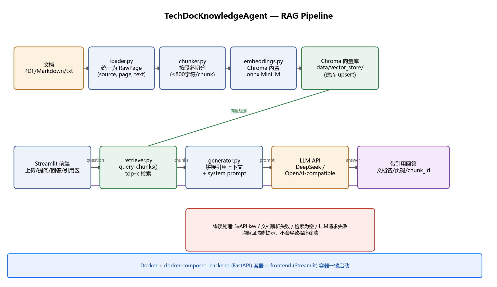
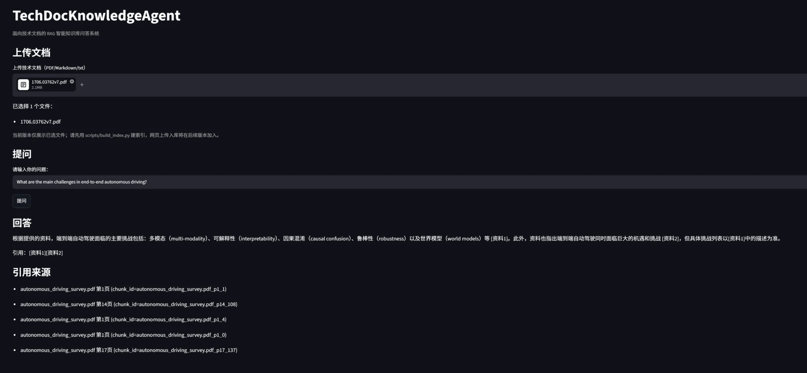
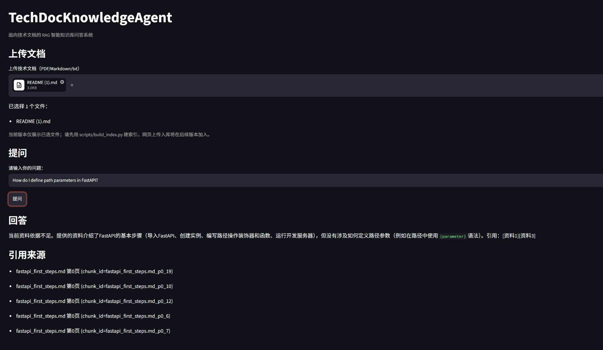
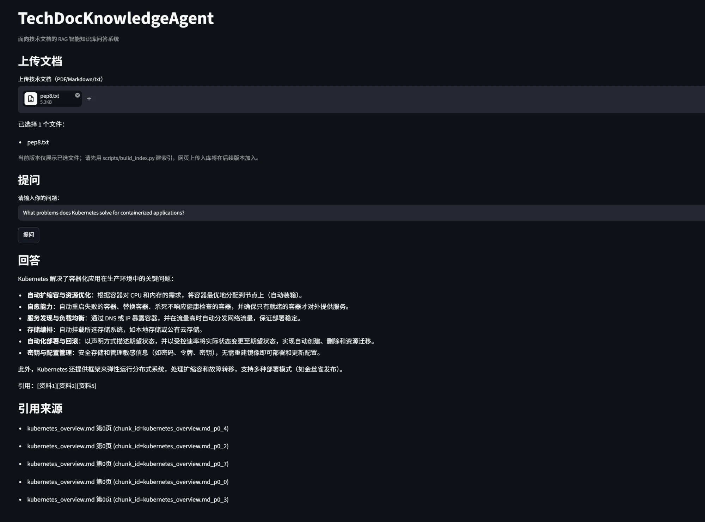

# TechDocKnowledgeAgent

[](https://github.com/whynotbeafool/techdoc-knowledge-agent/actions/workflows/tests.yml)

> 面向技术文档的证据锚定 RAG 系统与可复现检索评测基准：支持 PDF/Markdown/txt、语义检索、引用溯源和 Docker 部署。

## 项目背景

技术文档数量庞大，单纯关键词搜索难以覆盖改写、多证据与跨段推理问题。本项目一方面提供可运行的
RAG 问答 MVP，让用户通过自然语言获得带来源的答案；另一方面冻结语料、证据字符偏移和运行配置，
用于可复现地比较 BM25、Dense 及后续 Hybrid/Rerank 方法。

## 当前亮点

- 完整 MVP：上传、解析、切分、Chroma 检索、LLM 生成、引用展示与资料不足拒答。
- 证据锚定：金标准使用 canonical text 上的 Unicode 字符偏移，不依赖会随切分参数变化的 `chunk_id`。
- 语料版本化：manifest 保留历史 revision，`active-revisions.json` 明确选择每次实验采用的版本。
- 可复现实验：运行产物记录 QA、active revision、语料、Python、Chroma 和检索参数。
- 分层评测：分别按推理类型和词汇重叠度汇总 Evidence Recall、完整证据命中率与 MRR。
- 工程质量：104 项自动化测试，GitHub Actions 持续运行 Ruff、测试与覆盖率检查。

## 技术栈

- Backend: FastAPI
- Frontend: Streamlit
- RAG Pipeline: Custom pipeline in Phase 1; LangChain/LangGraph in later phases
- Vector DB: Chroma / Qdrant
- Embedding: Chroma 内置 onnxruntime MiniLM(Phase 1，免 API key/大模型下载）；后续可换 bge-m3 / API embedding
- LLM: DeepSeek API / Qwen API
- Retrieval: BM25 + vector search + rerank in Phase 2
- Deployment: Docker + docker-compose

## 架构图



## 设计决策

每个关键技术选择的备选方案、选择理由和已知代价，记录在
[docs/design-decisions.md](docs/design-decisions.md)——包括为什么引用溯源由代码强制输出而不依赖
LLM 自觉标注、为什么 Phase 1 不用 LangChain、为什么分块上限是 800 字符等。

## 功能截图

**上传文档 + 问答 + 引用溯源**（PDF 上传，问题命中 `autonomous_driving_survey.pdf`）


**资料不足时诚实拒答**（Markdown 上传，检索到的 chunk 未覆盖问题细节，系统未强行回答）


**跨文档主题命中**（txt 上传，问题命中 `kubernetes_overview.md`）


## 本地运行

```bash
# 1. install dependencies
pip install -r backend/requirements.txt
cp .env.example .env

# 2. start backend
uvicorn backend.app.main:app --reload

# 3. start frontend
streamlit run frontend/streamlit_app.py
```

## 命令行工具（用于验证 RAG pipeline，无需前端）

```bash
# 1. 解析并切分 data/raw_docs 下的文档，打印 chunk 列表
python scripts/parse_docs.py

# 2. 把 chunk 向量化并写入本地 Chroma 库
python scripts/build_index.py

# 3. 只测试检索，不调用 LLM
python scripts/query.py "your question here"

# 4. 完整 RAG 问答：检索 + 生成 + 打印引用来源
python scripts/ask.py "your question here"
```

## 研究评测语料

正式评测不直接以 `data/raw_docs/` 的临时提取结果为坐标系。每份来源文档先冻结成
canonical text，并将文本、`documents.jsonl` 和后续 QA 标注一起提交进版本库：

```bash
python scripts/build_canonical.py data/raw_docs/rag_paper.pdf \
  --document-id rag_paper --revision v1
```

`revision` 标识的是**一份不可变的 canonical 产物**，不是上游文档的版本号。源文件换新、
或者提取流程变化（pypdf 版本、页分隔符、规范化方式）都必须升 revision——两者都会让已记录的
字符偏移失效，下游无法区别对待。具体是哪一种原因，可以从记录里的 `source_hash` 和
`extraction.pipeline_version` 反查。

`documents.jsonl` 保留所有历史 revision；当前实验实际索引哪些版本由
`data/corpus/active-revisions.json` 显式决定，每个文档只能有一个 active revision。不要通过覆盖旧文件、
删除 manifest 历史行或把所有 revision 一起索引来“升级”语料。

读取时必须使用 `load_canonical_document()` 校验文本哈希，再交给
`chunk_canonical_document()`。chunk 的 `start_char / end_char` 是 canonical text 上
零基半开区间的 Unicode 码点下标，不是 UTF-8 字节偏移。正式评测不得使用 `chunk_id`
作为证据锚点，因为它会随 chunk 参数变化。

### 复现当前 pilot

冻结语料和标注均已提交，运行 BM25 + Dense 评测不需要原始 PDF 或 LLM API key：

```bash
python scripts/validate_eval.py
python scripts/check_annotation_plan.py
python scripts/evaluate_retrieval.py --run-id <new-run-id>
```

当前 `pilot-12-v2` 包含 12 条标注，其中 9 条 confirmed。对 7 条 confirmed answerable 问题，
BM25 的 Evidence Recall@3 为 0.7857、MRR@5 为 0.8571；Dense 分别为 0.6429 和 0.7429。
这些数字只用于验证评测链路和暴露数据构造问题，样本量不足以支持方法优劣结论。完整配置、逐题结果、
分层汇总及历史运行有效性说明见 [`results/runs/`](results/runs/README.md)。

## Docker 一键启动

```bash
docker compose up --build
# frontend: http://localhost:8501
# backend docs: http://localhost:8000/docs
```

## 项目状态

### Phase 1：RAG MVP（已完成）

- [x] 文档解析（PDF/Markdown/txt）+ 段落切分
- [x] Embedding + Chroma 向量检索（top-k）
- [x] LLM 问答 + 引用溯源（文档名/页码/chunk_id）
- [x] Streamlit 前端（上传区、提问框、回答区、引用区）；上传区支持真实建索引（点击“建立索引”即可解析+切分+写入 Chroma，无需再手动跑 CLI 脚本）
- [x] 错误处理：缺 API key、文档解析失败、检索为空、LLM 请求失败均不崩溃
- [x] Docker 打包验证：`docker compose up --build` 可启动 backend + frontend 两个容器，容器内已验证可完整跑通检索+生成
- [x] 架构图
- [x] 功能截图（3 张：正常问答、拒答、跨文档命中）

### Phase 2：研究评测基线（进行中）

- [x] 5 份 canonical 文档冻结、哈希校验和不可变 revision 管理
- [x] active revision 选择与非 active 金标准拦截
- [x] 12 题 pilot 标注（9 confirmed，3 needs_review）
- [x] BM25 / Dense 基线与逐题、分层、双 cohort 汇总产物
- [x] 推理类型与词汇重叠度两个独立分层轴
- [ ] 对照文献定稿标注规范，并完成 30 题 dev 集
- [ ] Hybrid、Rerank、Long-context 与 no-RAG 对照
- [ ] 引用校验、证据覆盖与拒答机制评测

## 后续规划

近期主线是完成文献对照与 30 题 dev 集，再扩展 Hybrid、Rerank 和生成可靠性评测。当前 pilot 的
样本量刻意保持较小，避免在标注规范定稿前批量生产需要返工的数据。

**已知技术债**：目前 FastAPI backend 只有 `/` 和 `/health` 两个占位路由，检索和问答逻辑由 `scripts/` 和 `frontend/streamlit_app.py` 直接 import `backend/app/rag/` 模块调用，尚未封装成 REST API。Phase 1 阶段这是合理的简化（本地单机场景下更快跑通），但严格的前后端分离（frontend 通过 HTTP 调用 backend）留作后续迭代。
