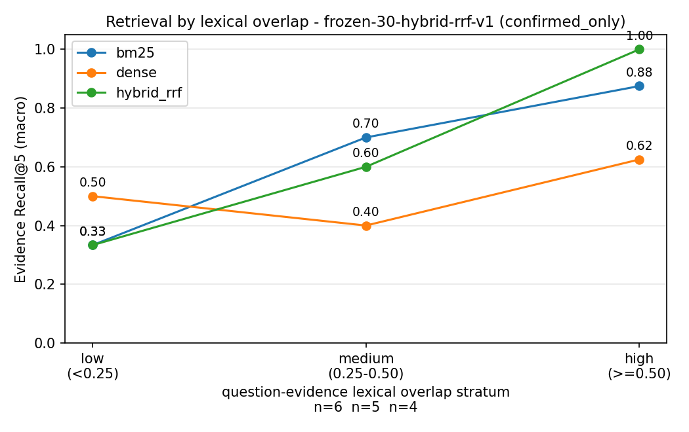

# Retrieval results: `frozen-30-hybrid-rrf-v1`

Generated from committed run artifacts by `scripts/report_results.py`. Do not edit by hand: regenerate instead, so the numbers here can never drift from the run they claim to describe.

## Provenance

| field | value |
|---|---|
| run_id | `frozen-30-hybrid-rrf-v1` |
| created_at | 2026-08-30T13:22:03.708614+00:00 |
| questions | 30 |
| qa.jsonl | `sha256:21eb2747289309cb5c17fe0ea5b85744220b246a80f7b0314d430d72f847b975` |
| active revisions | `sha256:203388e955c47416d0f78aadbeb5489ec128cebdf4ba8c602a2dbe8e743ce6af` |
| corpus | rag_paper@v1, autonomous_driving_survey@v1, fastapi_first_steps@v1, kubernetes_overview@v1, pep8@v2 |
| chunk_size / chunks | 800 / 379 |
| top_ks | [1, 3, 5] |
| python | 3.13.5 |
| bm25 | b=0.75, k1=1.5, tokenizer=[A-Za-z0-9_]+ |
| dense | chromadb_version=1.5.9, implementation=chromadb.DefaultEmbeddingFunction, model=all-MiniLM-L6-v2 |
| hybrid_rrf | candidate_depth_per_component=20, components=['bm25', 'dense'], implementation=reciprocal_rank_fusion, rank_constant=60, weights=equal |

## Answerable questions

| axis | stratum | cohort | n | bm25 R@1 | bm25 R@3 | bm25 R@5 | bm25 MRR@5 | bm25 CompleteHit@5 | dense R@1 | dense R@3 | dense R@5 | dense MRR@5 | dense CompleteHit@5 | hybrid_rrf R@1 | hybrid_rrf R@3 | hybrid_rrf R@5 | hybrid_rrf MRR@5 | hybrid_rrf CompleteHit@5 |
|---|---|---|---|---|---|---|---|---|---|---|---|---|---|---|---|---|---|---|
| overall | overall | all_annotations | 18 | 0.4167 | 0.6667 | 0.6667 | 0.6852 | 0.5000 | 0.3333 | 0.5278 | 0.5556 | 0.5667 | 0.3889 | 0.4167 | 0.5278 | 0.6667 | 0.6361 | 0.5556 |
| overall | overall | confirmed_only | 17 | 0.4118 | 0.6471 | 0.6471 | 0.6667 | 0.4706 | 0.3529 | 0.5294 | 0.5588 | 0.5706 | 0.4118 | 0.4118 | 0.5000 | 0.6471 | 0.6147 | 0.5294 |
| reasoning_type | single_evidence | all_annotations | 6 | 0.5000 | 0.6667 | 0.6667 | 0.5833 | 0.6667 | 0.1667 | 0.3333 | 0.3333 | 0.2500 | 0.3333 | 0.3333 | 0.5000 | 0.6667 | 0.4583 | 0.6667 |
| reasoning_type | single_evidence | confirmed_only | 6 | 0.5000 | 0.6667 | 0.6667 | 0.5833 | 0.6667 | 0.1667 | 0.3333 | 0.3333 | 0.2500 | 0.3333 | 0.3333 | 0.5000 | 0.6667 | 0.4583 | 0.6667 |
| reasoning_type | multi_evidence | all_annotations | 6 | 0.5000 | 0.7500 | 0.7500 | 0.8056 | 0.5000 | 0.5833 | 0.7500 | 0.7500 | 0.7500 | 0.6667 | 0.5833 | 0.5833 | 0.7500 | 0.7000 | 0.6667 |
| reasoning_type | multi_evidence | confirmed_only | 6 | 0.5000 | 0.7500 | 0.7500 | 0.8056 | 0.5000 | 0.5833 | 0.7500 | 0.7500 | 0.7500 | 0.6667 | 0.5833 | 0.5833 | 0.7500 | 0.7000 | 0.6667 |
| reasoning_type | multi_hop | all_annotations | 6 | 0.2500 | 0.5833 | 0.5833 | 0.6667 | 0.3333 | 0.2500 | 0.5000 | 0.5833 | 0.7000 | 0.1667 | 0.3333 | 0.5000 | 0.5833 | 0.7500 | 0.3333 |
| reasoning_type | multi_hop | confirmed_only | 5 | 0.2000 | 0.5000 | 0.5000 | 0.6000 | 0.2000 | 0.3000 | 0.5000 | 0.6000 | 0.7400 | 0.2000 | 0.3000 | 0.4000 | 0.5000 | 0.7000 | 0.2000 |
| lexical_overlap | low | all_annotations | 6 | 0.0833 | 0.3333 | 0.3333 | 0.3333 | 0.1667 | 0.2500 | 0.5000 | 0.5000 | 0.5000 | 0.3333 | 0.2500 | 0.2500 | 0.3333 | 0.3667 | 0.1667 |
| lexical_overlap | low | confirmed_only | 6 | 0.0833 | 0.3333 | 0.3333 | 0.3333 | 0.1667 | 0.2500 | 0.5000 | 0.5000 | 0.5000 | 0.3333 | 0.2500 | 0.2500 | 0.3333 | 0.3667 | 0.1667 |
| lexical_overlap | medium | all_annotations | 5 | 0.3000 | 0.7000 | 0.7000 | 0.6667 | 0.4000 | 0.3000 | 0.3000 | 0.4000 | 0.4400 | 0.2000 | 0.3000 | 0.4000 | 0.6000 | 0.5500 | 0.4000 |
| lexical_overlap | medium | confirmed_only | 5 | 0.3000 | 0.7000 | 0.7000 | 0.6667 | 0.4000 | 0.3000 | 0.3000 | 0.4000 | 0.4400 | 0.2000 | 0.3000 | 0.4000 | 0.6000 | 0.5500 | 0.4000 |
| lexical_overlap | high | all_annotations | 4 | 0.7500 | 0.8750 | 0.8750 | 1.0000 | 0.7500 | 0.5000 | 0.6250 | 0.6250 | 0.7500 | 0.5000 | 0.5000 | 0.7500 | 1.0000 | 0.8750 | 1.0000 |
| lexical_overlap | high | confirmed_only | 4 | 0.7500 | 0.8750 | 0.8750 | 1.0000 | 0.7500 | 0.5000 | 0.6250 | 0.6250 | 0.7500 | 0.5000 | 0.5000 | 0.7500 | 1.0000 | 0.8750 | 1.0000 |

## False-premise questions (counter-evidence retrieval)

Reported separately: these questions restate the premise they refute, so they are lexically close to their counter-evidence by construction and must not be pooled with ordinary answerable questions.

| axis | stratum | cohort | n | bm25 R@1 | bm25 R@3 | bm25 R@5 | bm25 MRR@5 | bm25 CompleteHit@5 | dense R@1 | dense R@3 | dense R@5 | dense MRR@5 | dense CompleteHit@5 | hybrid_rrf R@1 | hybrid_rrf R@3 | hybrid_rrf R@5 | hybrid_rrf MRR@5 | hybrid_rrf CompleteHit@5 |
|---|---|---|---|---|---|---|---|---|---|---|---|---|---|---|---|---|---|---|
| overall | overall | all_annotations | 6 | 0.8333 | 1.0000 | 1.0000 | 0.9167 | 1.0000 | 0.6667 | 0.6667 | 0.6667 | 0.6667 | 0.6667 | 0.8333 | 0.8333 | 1.0000 | 0.8750 | 1.0000 |
| overall | overall | confirmed_only | 6 | 0.8333 | 1.0000 | 1.0000 | 0.9167 | 1.0000 | 0.6667 | 0.6667 | 0.6667 | 0.6667 | 0.6667 | 0.8333 | 0.8333 | 1.0000 | 0.8750 | 1.0000 |
| reasoning_type | single_evidence | all_annotations | 6 | 0.8333 | 1.0000 | 1.0000 | 0.9167 | 1.0000 | 0.6667 | 0.6667 | 0.6667 | 0.6667 | 0.6667 | 0.8333 | 0.8333 | 1.0000 | 0.8750 | 1.0000 |
| reasoning_type | single_evidence | confirmed_only | 6 | 0.8333 | 1.0000 | 1.0000 | 0.9167 | 1.0000 | 0.6667 | 0.6667 | 0.6667 | 0.6667 | 0.6667 | 0.8333 | 0.8333 | 1.0000 | 0.8750 | 1.0000 |
| lexical_overlap | low | all_annotations | 1 | 1.0000 | 1.0000 | 1.0000 | 1.0000 | 1.0000 | 0.0000 | 0.0000 | 0.0000 | 0.0000 | 0.0000 | 1.0000 | 1.0000 | 1.0000 | 1.0000 | 1.0000 |
| lexical_overlap | low | confirmed_only | 1 | 1.0000 | 1.0000 | 1.0000 | 1.0000 | 1.0000 | 0.0000 | 0.0000 | 0.0000 | 0.0000 | 0.0000 | 1.0000 | 1.0000 | 1.0000 | 1.0000 | 1.0000 |
| lexical_overlap | medium | all_annotations | 2 | 0.5000 | 1.0000 | 1.0000 | 0.7500 | 1.0000 | 1.0000 | 1.0000 | 1.0000 | 1.0000 | 1.0000 | 1.0000 | 1.0000 | 1.0000 | 1.0000 | 1.0000 |
| lexical_overlap | medium | confirmed_only | 2 | 0.5000 | 1.0000 | 1.0000 | 0.7500 | 1.0000 | 1.0000 | 1.0000 | 1.0000 | 1.0000 | 1.0000 | 1.0000 | 1.0000 | 1.0000 | 1.0000 | 1.0000 |
| lexical_overlap | high | all_annotations | 2 | 1.0000 | 1.0000 | 1.0000 | 1.0000 | 1.0000 | 0.5000 | 0.5000 | 0.5000 | 0.5000 | 0.5000 | 0.5000 | 0.5000 | 1.0000 | 0.6250 | 1.0000 |
| lexical_overlap | high | confirmed_only | 2 | 1.0000 | 1.0000 | 1.0000 | 1.0000 | 1.0000 | 0.5000 | 0.5000 | 0.5000 | 0.5000 | 0.5000 | 0.5000 | 0.5000 | 1.0000 | 0.6250 | 1.0000 |

## How to read this

- Only `reasoning_type` cells partition the cohort. `lexical_overlap` cells omit questions with no recorded overlap, so their counts need not sum to `overall`.
- `all_annotations` includes `needs_review` records; `confirmed_only` does not. A ranking that flips between the two cohorts is unstable and must be reported as such.
- Evidence Recall@1 is capped by how many gold evidence items a question has, so it is not comparable across question types with different evidence counts.

## Figure

